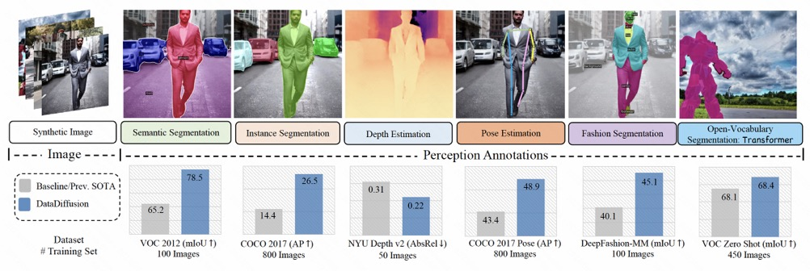
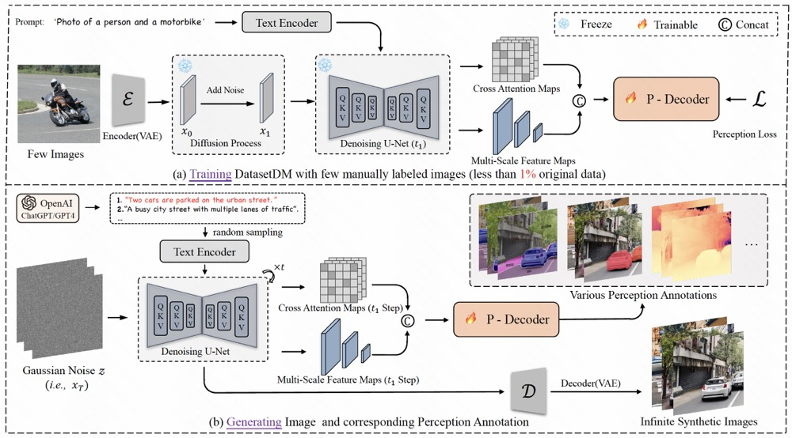
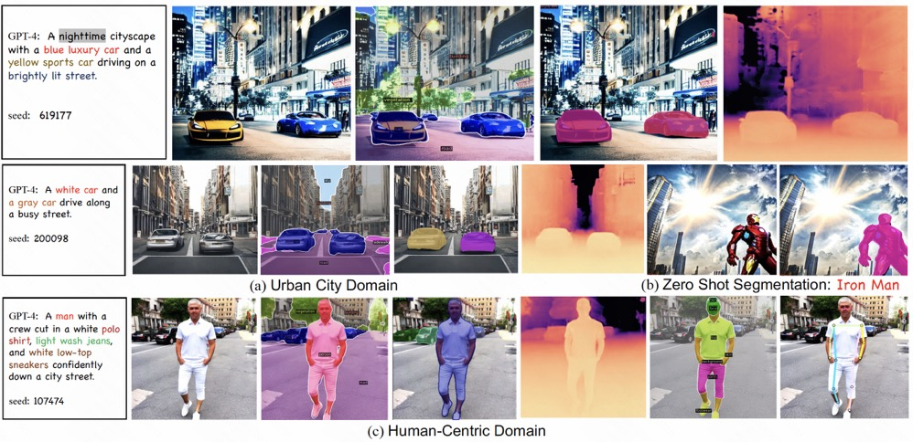
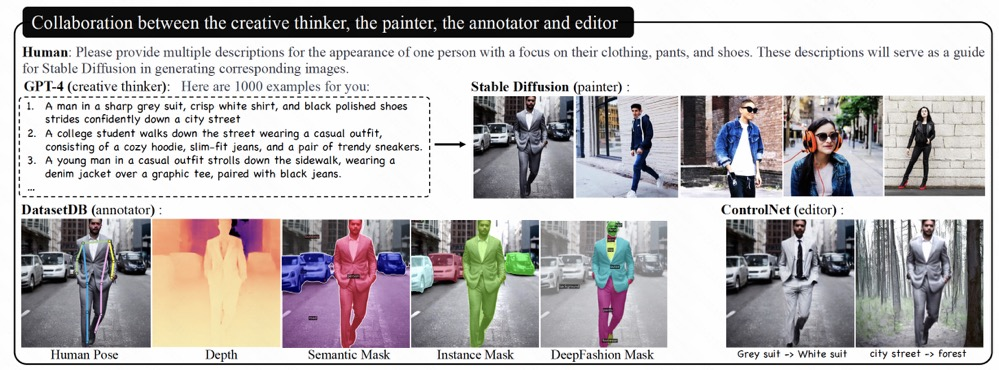

# DatasetDM (NeurIPS2023)
Official code for 'DatasetDM:Synthesizing Data with Perception Annotations Using Diffusion Models'


<p align="center">
  
<br>
</p>

[Project Website](https://weijiawu.github.io/DatasetDM_page/)  | [Paper](https://arxiv.org/abs/2308.06160)

## :fire: News

* **[2023.9.22]** the paper was accepted by NeurIPS2023.

* **[note]** We will release the code within three months. Please wait.


* **[2023.8.11]** We initialize the Repo.


## :paintbrush: DEMO
ToDo

## :notes: Introduction


<p align="center">
  
<br>
</p>


## :bookmark_tabs: Supported Task
- [x] Instance Segmentation (COCO2017)
- [x] Semantic Segmentation (VOC, Cityscapes)
- [x] Depth Estimation
- [x] Open Pose
- [x] DeepFashion Segmentation
- [x] Open Segmentation
- [x] Long-tail Segmentation

## :bulb: Demo
To demonstrate the high-quality synthetic data, we visualized synthetic data from two domains: human-centric and urban city:
<p align="center">
  
<br>
</p>

Large language model, GPT-4, is adopted to enhance the diversity of generative data:
<p align="center">
  
<br>
</p>

## :bulb: Todo
- [ ] Hugging Face Demo
- [ ] ...

## :hammer_and_wrench: Getting Started

### Installation
```sh
conda create -n DatasetDM python=3.8
```

Install the corresponding torch==1.9.1, please refer to [pytorch](https://pytorch.org/get-started/previous-versions/).
Such as:
```sh
pip install torch==1.9.1+cu111 torchvision==0.10.1+cu111 torchaudio==0.9.1 -f https://download.pytorch.org/whl/torch_stable.html  
```
Then install other packages:
```sh
python -m pip install -r requirements.txt
```

Download the weights and configuration files of [SD 1.4](https://huggingface.co/CompVis/stable-diffusion-v1-4/tree/main) and place them in the ```./dataset/ckpts``` directory.

Download the diffusers
```
cd model
git clone https://github.com/huggingface/diffusers.git
```

### Dataset Prepare

- Depth Estimation: Please follow [MED](https://github.com/zhyever/Monocular-Depth-Estimation-Toolbox) to prepare the dataset on ```./data```

- Segmentation: VOC, Cityscapes, and COCO: Please follow [Mask2former](https://github.com/facebookresearch/Mask2Former) to prepare the dataset on ```./data```

The final dataset should be ordered as follow:


```
data/
    PascalVOC12/
	JPEGImages
	SegmentationClassAug
	splits/
	     train_aug.txt
    COCO2017/
	train2017/
		2011_003261.jpg
        	...
	annotations/
		instances_train2017.json	
		person_keypoints_train2017.json
     VirtualKITTI2/
	Depth/
		Scene01
		Scene02
		...
	Image/
		Scene01
		Scene02
		...
     nyudepthv2/
	sync/
	official_splits/
		test/
	nyu_class_list.json
	train_list.txt
	test_list.txt
     kitti/
	input/
	gt_depth/
	kitti_eigen_train.txt
     deepfashion-mm/
	images/
	segm/
	captions.json/
	train_set.txt/
	test_set.txt
```


Besides, you also need to order the prompt txt files as follows:

```
dataset/
	Prompts_From_GPT/
		deepfashion_mm/
			general.txt
		coco_pose/
			general.txt
		KITTI/
			general.txt
		NYU/
			general.txt
		coco/
			toothbrush.txt
			hair drier.txt
			book.txt
			...
		cityscapes/
			bicycle.txt
			motorcycle.txt
			bus.txt
			...
```

## :paintbrush: Table of Contents <!-- omit in toc -->
- [Semantic Segmentation](#Semantic-Segmentation)
- [Instance Segmentation](#Instance-Segmentation)
- [Depth Estimation](#Depth-Estimation)
- [Open Pose](#Open-Pose)
- [Zero-Shot Semantic Segmentation](#Zero-Shot-Semantic-Segmentation)
- [Fashion Segmentation](#Fashion-Segmentation)
- [Long tail Segmentation](#Long-tail-Segmentation)

### Semantic Segmentation

#### [VOC 2012](http://host.robots.ox.ac.uk/pascal/VOC/voc2012/)

```sh
# For Segmentation Tasks
sh ./script/train_semantic_VOC.sh
```


```sh
# Generate synthetic data for VOC
sh ./script/data_generation_VOC_semantic.sh
```

```sh
# Visualization of generative data
python ./DataDiffusion/vis_VOC.py
```

#### [Cityscapes](https://www.cityscapes-dataset.com/)

```sh
# For Segmentation Tasks
sh ./script/train_semantic_Cityscapes.sh
```


```sh
# Generate synthetic data for Cityscapes
sh ./script/data_generation_Cityscapes_semantic.sh
```


Before training the existing segmentation model~(), you should adopt the augmentation:
```sh
sh ./script/augmentation_Cityscapes.sh
```


```sh
# Visualization of generative data
python ./DataDiffusion/vis_Cityscapes.py
```


### Instance Segmentation

#### [COCO 2017](https://cocodataset.org/#home)
```sh
# For Segmentation Tasks
sh ./script/train_COCO.sh
```

```sh
# Generate synthetic data for COCO
sh ./script/data_generation_coco_instance.sh
```

```sh
# Visualization of generative data
python ./DataDiffusion/vis_COCO.py
```

Data Augmentation with image splicing 
```sh
# Augmentation of generative data
sh ./script/augmentation_coco.sh
```
Then training [Mask2former](https://github.com/facebookresearch/Mask2Former) with these synthetic data, enjoy! 


### Depth Estimation

#### [KITTI](https://www.cvlibs.net/datasets/kitti/)

```sh
# Training Depth Estimation Tasks on KITTI
sh ./script/train_depth_KITTI.sh
```


If you want to training with Virtual_KITTI_2, using the blow script:
```sh
# Training Depth Estimation Tasks on Virtual KITTI 2
sh ./script/train_depth_Virtual_KITTI_2.sh
```


```sh
# Generate synthetic data for KITTI
sh ./script/data_generation_KITTI_depth.sh
```

Then training any existing [Depth Estimation Method](https://github.com/zhyever/Monocular-Depth-Estimation-Toolbox/tree/633580d0ed7395734a034abfebf2ddb6ad579d75) with these synthetic data, enjoy! 

In our paper, we adopt [Depthformer](https://github.com/zhyever/Monocular-Depth-Estimation-Toolbox/tree/633580d0ed7395734a034abfebf2ddb6ad579d75/configs/depthformer) to valid the quality of generative data.


#### [NYU-Depth-V2](https://cs.nyu.edu/~silberman/datasets/nyu_depth_v2.html)

```sh
# For Depth Estimation Tasks
sh ./script/train_depth_NYU.sh
```

```sh
# Generate synthetic data for NYU
sh ./script/data_generation_NYU_depth.sh
```

Data Augmentation with image splicing 
```sh
# Augmentation of generative data
sh ./script/augmentation_NYU.sh
```

Then training any existing [Depth Estimation Method](https://github.com/zhyever/Monocular-Depth-Estimation-Toolbox/tree/633580d0ed7395734a034abfebf2ddb6ad579d75) with these synthetic data, enjoy! 

In our paper, we adopt [Depthformer](https://github.com/zhyever/Monocular-Depth-Estimation-Toolbox/tree/633580d0ed7395734a034abfebf2ddb6ad579d75/configs/depthformer) to valid the quality of generative data.


### Open Pose

#### [COCO 2017](https://cocodataset.org/#home)

```sh
# Training Pose Estimation Tasks on COCO2017
sh ./script/train_pose_coco.sh
```

```sh
# Generate synthetic data for Pose on COCO
sh ./script/data_generation_COCO_Pose.sh
```

Then you need convert the data to coco format, and training any existing Pose Estimation Method with these dataset. Here, we adopt [SimCC](https://github.com/leeyegy/SimCC) to valid the quality of generative data.


### Zero-Shot Semantic Segmentation
#### [PASCAL VOC 2012](http://host.robots.ox.ac.uk/pascal/VOC/voc2012/)
Download [VOC 2012](http://host.robots.ox.ac.uk/pascal/VOC/voc2012/), and order the dataset.


```sh
# For Zero Shot Segmentation Tasks
sh ./script/train_semantic_VOC_zero_shot.sh
```


```sh
# Generate synthetic data for VOC
sh ./script/data_generation_VOC_semantic.sh
```


Data Augmentation with image splicing 
```sh
# Augmentation of generative data
sh ./script/augmentation_VOC.sh
```
Then training [Mask2former](https://github.com/facebookresearch/Mask2Former) with these synthetic data, enjoy! 

### Fashion-Segmentation

#### [DeepFashion-MM](https://github.com/yumingj/DeepFashion-MultiModal)
Download [DeepFashion-MM](https://github.com/yumingj/DeepFashion-MultiModal), and order the dataset.

```sh
# Train DeepFashion Segmentation Tasks
sh ./script/train_semantic_DeepFashion_MM.sh
```

```sh
# Generate synthetic data for DeepFashion-MM
sh ./script/parallel_generate_Semantic_DeepFashion.py
```

Then training [Mask2former](https://github.com/facebookresearch/Mask2Former) or other Segmentation Methods~[mmsegmentation](https://github.com/open-mmlab/mmsegmentation) with these synthetic data, enjoy! 


### Long-tail-Segmentation (VOC)

```sh
# For LongTail semantic segmentation
sh ./script/train_semantic_VOC_LongTail.sh
```

```sh
# Generate synthetic data for VOC
sh ./script/data_generation_VOC_semantic.sh
```


Data Augmentation with image splicing 
```sh
# Augmentation of generative data
sh ./script/augmentation_VOC.sh
```

### Long-tail-Segmentation (LVIS)

```sh
# For LongTail semantic segmentation
sh ./script/train_instance_LVIS.sh
```

```sh
# Generate synthetic data for VOC
sh ./script/data_generation_LVIS_instance.sh
```

## Acknowledgements
This work draws inspiration from the following code as references. We extend our gratitude to these remarkable contributions:

- [Grounded-Diffusion](https://github.com/Lipurple/Grounded-Diffusion)
- [Mask2Former](https://github.com/facebookresearch/Mask2Former) 
- [GenPromp](https://github.com/callsys/GenPromp)
- [Depthformer](https://github.com/zhyever/Monocular-Depth-Estimation-Toolbox/tree/633580d0ed7395734a034abfebf2ddb6ad579d75/configs/depthformer)
- [DeepFashion-MM](https://github.com/yumingj/DeepFashion-MultiModal)


## Citation

```
@article{wu2023datasetdm,
  title={DatasetDM: Synthesizing Data with Perception Annotations Using Diffusion Models},
  author={Wu, Weijia and Zhao, Yuzhong and Chen, Hao and Gu, Yuchao and Zhao, Rui and He, Yefei and Zhou, Hong and Shou, Mike Zheng and Shen, Chunhua},
  journal={arXiv preprint arXiv:2308.06160},
  year={2023}
}
```

